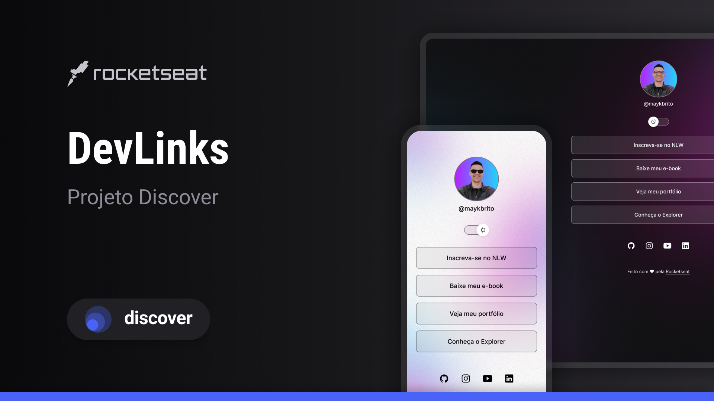

<h1 align="center"> 🔗 DevLinks - Portfolio </h1>

  Um agregador de links personalizado para centralizar meu portfólio, redes sociais e contatos em um só lugar.

  <a href="#-tecnologias">Tecnologias</a>&nbsp;&nbsp;&nbsp;|&nbsp;&nbsp;&nbsp;
  <a href="#-projeto">Projeto</a>&nbsp;&nbsp;&nbsp;|&nbsp;&nbsp;&nbsp;
  <a href="#-aprendizado">Aprendizado</a>&nbsp;&nbsp;&nbsp;|&nbsp;&nbsp;&nbsp;
  <a href="#-layout">Layout</a>&nbsp;&nbsp;&nbsp;|&nbsp;&nbsp;&nbsp;
  <a href="#memo-licença">Licença</a>

  

 

  

## 🚀 Tecnologias

Esse projeto foi desenvolvido com as seguintes tecnologias:

- **HTML e CSS**
- **JavaScript**
- **Git e GitHub**
- **Figma**

## 💻 Projeto

O **DevLinks** é o meu primeiro projeto como programador! Ele funciona como uma "Link Tree" personalizada, onde reuni os meus links mais importantes, como:

- **GitHub** (para acompanhar meus códigos)
- **LinkedIn** (conexão profissional)
- **Instagram** (meu dia a dia)
- **WhatsApp** (contato direto)

O projeto também conta com uma funcionalidade de troca de tema (Dark/Light Mode) baseada na preferência do usuário.

## 🧠 Aprendizado

Neste primeiro projeto, pude colocar em prática conceitos fundamentais de desenvolvimento web:

- **HTML:** Estruturação de conteúdo e uso de tags semânticas.
- **CSS:** Estilização, uso de variáveis para o Light/Dark mode, Flexbox para alinhamentos e responsividade.
- **JavaScript:** Manipulação do DOM (Document Object Model) para criar a lógica de troca de temas e interação com o switch.
- **Figma:** Interpretação de designs profissionais e exportação de assets.
- **Git/GitHub:** Controle de versão e hospedagem do projeto.

Eu gostei muito de criar esse projeto e estou motivado com os resultados e pretendo continuar estudando para aprimorar minhas habilidades e construir projetos cada vez mais complexos!

## 🔖 Layout

Você pode visualizar o layout base que utilizei para me inspirar através [DESTE LINK](https://www.figma.com/pt-br/comunidade/file/1187422022288947321/devlinks-projeto-discover).

## :memo: Licença

Esse projeto está sob a licença MIT.

---

Feito com ♥ by Rocketseat 👋 [Participe da nossa comunidade!](https://discord.gg/rocketseat)
